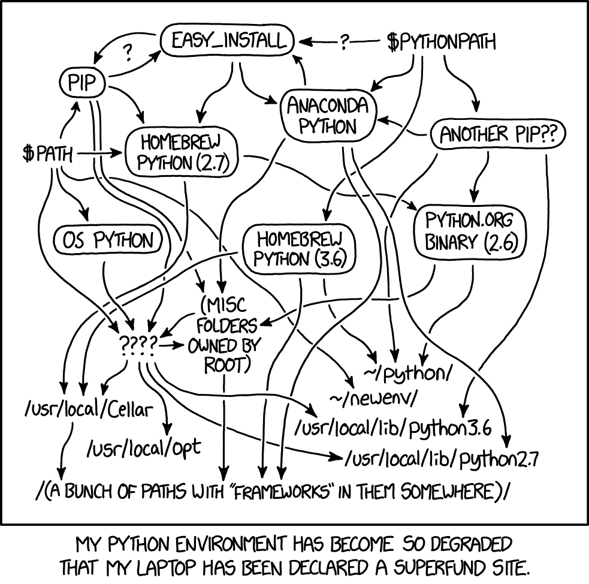

Neste artigo vou apresentar o [Pipenv](https://docs.pipenv.org/en/latest/) para gerenciar ambientes de desenvolvimento Python.

Gerenciar o ambiente de desenvolvimento e as dependências dos projetos de software é um problema bem solucionado em algumas linguagens. Para quem desenvolve em vários ambientes é impossível não comparar. Programo constantemente em linguagens como JavaScript, Ruby e Python, boa parte do tempo nas duas primeiras, e sempre que vou trabalhar em um projeto em Python sinto um constrangimento em como tenho que gerenciar o ambiente de desenvolvimento.



As ferramentas disponíveis para gerenciar projetos Python evoluíram muito nos últimos anos. Aqui na MLabs estamos acostumados a usar o pip, [Virtualenv](https://virtualenv.pypa.io/en/stable/) e o [pyenv](https://github.com/pyenv/pyenv) para gerenciar nossos projetos. Porém, sempre me pareceu que faltava algo mais fluído. Embora o uso do pip com as dependências listadas em um arquivo requirements.txt geralmente seja suficiente, em projetos maiores precisamos manter pelo menos dois arquivos separados com dependências diferentes para o ambiente de desenvolvimento e de produção. Ainda, caso tenhamos diversos projetos no nosso ambiente de desenvolvimento, precisamos usar explicitamente o Virtualenv para isolar as dependências com diferentes versões para cada projeto.

## Pipenv

O Pipenv tem por objetivo melhorar o gerenciamento de projetos, trazendo para o desenvolvimento de aplicações Python o que existe de melhor em ferramentas como [Bundler](https://bundler.io/) e [Yarn](https://yarnpkg.com/en/). Ele surgiu a um ano atrás e já se tornou o gerenciador de dependências [recomendado](https://packaging.python.org/tutorials/managing-dependencies/#managing-dependencies) para projetos Python.

Com o Pipenv, podemos criar e gerenciar automaticamente ambientes virtuais isolados para cada projeto, fazer o gerenciamento das dependências do projeto e também instalar e atualizar ambientes de forma determinística. Se o pyenv estiver instalado, ele ainda instala automaticamente a versão do Python especificada no projeto.

## Instalando

Para instalar:

```bash
pip install --user pipenv
cd projeto
pipenv install
```

Serão criados os arquivos `Pipfile` e `Pipfile.lock` no diretório do seu projeto. O Pipfile tem função similar ao do tradicional `requirements.txt` de listar as dependências e versões caso você precise reinstalá-las, porém possui algumas vantagens, como separar as dependências de cada ambiente e listar a versão do Python usada no projeto. O `Pipfile.lock` garante a instalação determinística das dependências quando o projeto é distribuído.

## Convertendo um projeto existente

Converter seu projeto para o formato usando pelo Pipenv é fácil, apenas execute o comando abaixo:

```bash
pipenv install -r requirements.txt
```

Revise o `Pipfile` gerado e separe suas dependências de produção e desenvolvimento. Seu `Pipfile` deve ficar parecido com este:

```bash
[[source]]
url = “https://pypi.python.org/simple"
verify_ssl = true
name = “pypi”

[packages]
flask = “==0.12.2”
flask-sqlalchemy = “==2.2”
sqlalchemy = “==1.2.6”
python-dotenv = “==0.7.1”

[dev-packages]
“flake8” = “*”
pytest = “*”
flask-testing = “*”
feito = “*”

[requires]
python_version = “3.6”
```

## Recursos da ferramenta

Instalar e remover pacotes é fácil e intuitivo:

```bash
pipenv install package
pipenv uninstall package
```

Para instalar pacotes usados apenas no ambiente de desenvolvimento:

```bash
pipenv install --dev package
```

Para instalar todos os pacotes listados no Pipfile:

```bash
pipenv install
```

Incluindo os pacotes do ambiente de desenvolvimento:

```bash
pipenv install --dev
```

Como o Pipenv gerencia para nós os ambientes virtuais e a versão do Python do projeto, precisamos usar alguns comandos para garantir que estamos executando nossos scripts dentro do ambiente virtual do projeto. Para executar um script:

```bash
pipenv run python script.py
```

E caso você queira ativar o ambiente virtual no seu shell atual, use:

```bash
pipenv shell
```

Esse comando tera efeito similar ao `activate` do Virtualenv.

Fiquei bem feliz em conhecer o Pipenv. Sempre senti que faltava uma ferramenta desse tipo no universo Python. A ferramenta já é reconhecida como a primeira opção para o gerenciamento de projetos Python, então recomendo a todos que estejam desenvolvendo em Python que testem ela em seus projetos, tenho certeza que o fluxo de desenvolvimento se tornará mais agradável.
