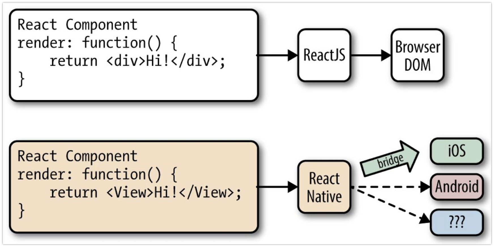

Neste artigo vou mostrar como desenvolver um módulo iOS nativo para React Native.

## Background

Todo mês, em uma sexta-feira, o time da [Magrathea](https://magrathealabs.com/) sai do ambiente tradicional da empresa e nos dedicamos a projetos experimentais para descobrir e explorar novas tecnologias, testar metodologias, ferramentas ou até mesmo validar ideias de produtos. Nós chamamos estas sextas-feiras de Hackdays.

Em um dos Hackdays um dos projetos desenvolvidos foi motivado pela experimentação da tecnologia data over sound (DoS), que permite codificar dados em séries de sons e tons audíveis ou inaudíveis quase-ultra-sônicos para formar um identificador único sonoro. Os dados são codificados em um dispositivo antes da transmissão, e decodificado em um ou mais dispositivos receptores. Qualquer dispositivo que contenha um alto-falante pode emitir esse tipo de sinal, e qualquer dispositivo com um microfone pode receber e decodificar ele.

Existem diversas aplicações possíveis para esse tipo de tecnologia, como: entretenimento, TV, rádio, games, automação residencial sem o uso de wifi ou bluetooth, sistemas de autenticação para liberação de acesso, sistema de autenticação em dois fatores, pagamento, ticketing, automação industrial, transmissão de informações para um grande número de pessoas em um mesmo ambiente. Se você pensar em beacons e identificadores únicos, talvez DoS faça sentido para o problema que você está tentando resolver. As possibilidades são muitas. Existe inclusive um caso de uso muito interessado da tecnologia em uma usina nuclear. Como ondas de rádio (wifi, bluetooth) podem causar interferências nos equipamentos, a transmissão de dados por áudio o é uma solução interessante.

A empresa líder de mercado nesta área é a [Chirp](https://www.chirp.io/). A Chirp fornece SDKs em diversas plataformas e linguagens, incluindo [Android](http://developers.chirp.io/v2/docs/chirp-for-android),  [Arduino](http://developers.chirp.io/v2/docs/chirp-and-embedded-devices),  [iOS](http://developers.chirp.io/v2/docs/chirp-for-ios), [JavaScript](http://developers.chirp.io/v2/docs/chirp-for-javascript) e [Python](http://developers.chirp.io/v2/docs/chirp-for-python). Em toda as plataformas é possível enviar sinais codificados, porém apenas com iOS e Android é possível decodificar.  Escolhemos desenvolver um protótipo de aplicação usando o React Native. Devido a limitação da biblioteca JavaScript resolvemos criar um wrapper para React Native do SDK para o iOS. É aqui que começa de verdade o problema que vou mostrar como solucionar neste post.

## React Native

O React Native é uma biblioteca de código e um ecossistema de ferramentas que permite que você crie aplicativos usando JavaScript. Ele usa o mesmo princípio de design do React, permitindo que você crie uma interface usando componentes.

Com o React Native você constrói aplicativos que são indistinguíveis de um aplicativo criado usando Objective-C ou Java. O React Native usa os mesmos blocos de construção de UI fundamentais que os aplicativos nativos iOS e Android, fornecendo interfaces para as APIs nativas.




Para você ter uma ideia, este seria um hello world escrito em React Native:

```javascript
import React, { Component } from 'react';
import { Text, View } from 'react-native';

class App extends Component {
  render() {
    return (
      <View>
        <Text>Olá Mundo!</Text>
      </View>
    );
  }
}
```

Apesar do React Native fornecer uma grande quantidade de wrappers para as APIs nativas, existem muitas APIs que ainda não podem ser acessadas, em especial as de terceiros. Mas é fácil criar nossos próprios módulos nativos. Se existe uma funcionalidade nativa que precisamos acessar mas não existe um wrapper pronto em JavaScript, podemos escrever a abstração necessária.

## Desenvolvendo o mólulo

Vamos comer adicionando a funcionalidade que queremos usar do SDK Chirp na aplicação iOS. Precisamos adicionar dois arquivos de código no projeto, um header `.h` com a interface e um de implementação `.m`.

Primeiro, o header `ChirpNative.h`:

```objectivec
#import <Foundation/Foundation.h>
#import <React/RCTBridgeModule.h>
#import <React/RCTEventEmitter.h>

@interface NativeChirp : RCTEventEmitter <RCTBridgeModule>
@end
```

E a implementação do `ChirpNative.m`:

```objectivec
#import "ChirpNative.h"
#import "React/RCTLog.h"
#import <ChirpSDK/ChirpSDK.h>

#define CHIRP_APP_KEY    <CHIRP_APP_KEY>
#define CHIRP_APP_SECRET <CHIRP_APP_SECRET>

@implementation NativeChirp

RCT_EXPORT_MODULE();

- (NSArray<NSString *> *)supportedEvents
{
  return @[@"ChirpReceived"];
}

RCT_EXPORT_METHOD(configChirp) {
  [[ChirpSDK sdk] setAppKey:CHIRP_APP_KEY andSecret:CHIRP_APP_SECRET withCompletion:^(BOOL authenticated, NSError * _Nullable error) {
    if (!authenticated || error) {
      RCTLogInfo(@"Chirp authentication error : %@", error.description);
    }
  }];

  [[ChirpSDK sdk] setChirpHeardBlock:^(Chirp *chirp, NSError *error)
   {
     if (!error && chirp) {
       [chirp fetchAssociatedDataWithCompletion:^(Chirp *chirp, NSError *error) {
         NSDictionary *data = [chirp data];
         NSString *text = data[@"text"];
         RCTLogInfo(@"Message: %@", text);
         [self sendEventWithName:@"ChirpReceived" body:@{@"text": text}];
       }];

     }
     else {
       RCTLogInfo(@"Error: %@", error);
     }
   }];

  [[ChirpSDK sdk] start];
}

RCT_EXPORT_METHOD(dispatchEvent:(NSString *)text) {
  RCTLogInfo(@"Dispatch event %@", text);
  [self sendEventWithName:@"ChirpReceived" body:@{@"text": text}];
}
@end
```

Como não passamos nenhum argumento para `RCT_EXPORT_MODULE`, nosso módulo nativo vai ter o nome da nossa classe `ChirpNative`. Com isso, temos o esqueleto de um módulo nativo. Recomendo que você faça tudo isso dentro do XCode para facilitar o processo de build.

## Usando o módulo

Usar o módulo nativo é fácil, podemos importar ele em nosso código JavaScript da seguinte forma:

```javascript
import { NativeModules } from 'react-native'

const ChirpNative = NativeModules.ChirpNative;
```

Um benefício de construir o módulo dessa forma é que, se quisermos executar códigos nativos diferentes dependendo da plataforma, podemos isolar cada código em seu próprio módulo, ao invés de espalhar verificações de plataforma por diversas partes do aplicativo.

Para mais detalhes, recorra a [documentação de módulos do React Native](http://facebook.github.io/react-native/docs/native-modules-ios.html).
