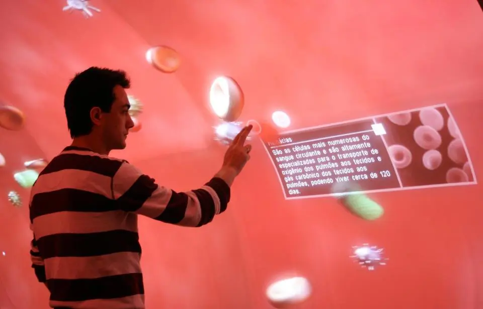
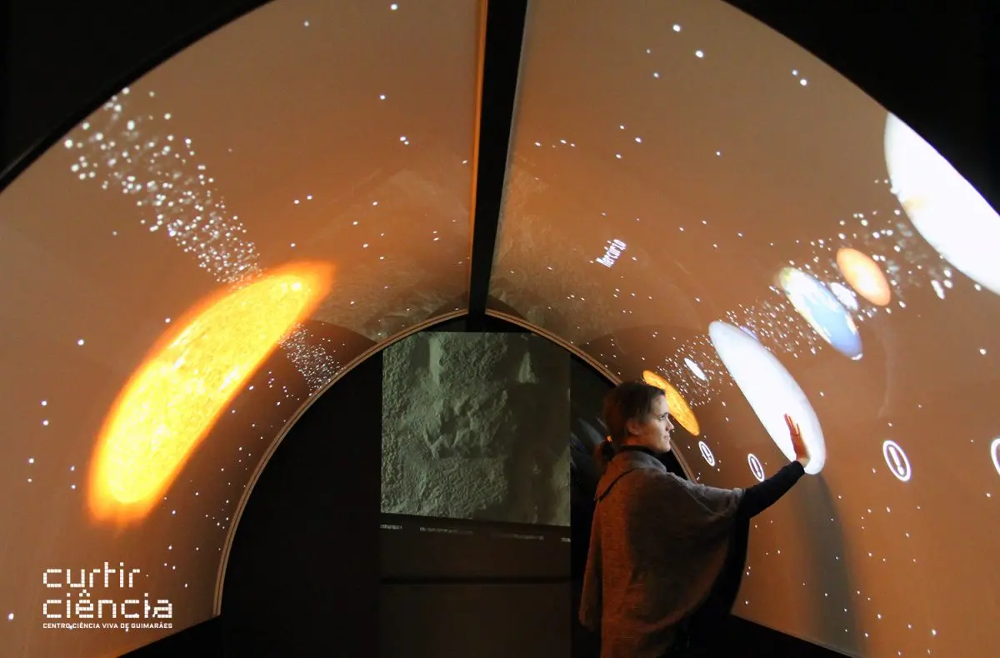

Em 2008, trabalhei no [Centro de Computação Gráfica](https://ccg.pt/) de Guimarães, Portugal, desenvolvendo aplicações para interfaces multitoque. Para o túnel interativo do Centro de Ciência Viva de Guimarães, desenvolvi uma aplicação que permitia aos visitantes explorar o sistema circulatório por meio de interações multitoque na superfície de projeção.

Hoje, esse tipo de tecnologia está consolidado, mas, na época, era um novo desafio: buscávamos criar reproduções de código aberto de interfaces semelhantes à do Microsoft Surface. O túnel imersivo era composto por uma estrutura curva de seis metros de comprimento, com Plexiglas e tela de projeção, seis projetores de cada lado do túnel, barras emissoras de infravermelho, câmeras com filtros de luz visível, dois computadores para controlar a projeção e as câmeras e um computador para executar a aplicação. A posição do toque na tela era identificada pela variação na reflexão da luz infravermelha ao tocar a tela.

A instalação também foi usada para executar um software sobre o Sistema Solar, desenvolvido por outra pessoa:

**Parceiros envolvidos no projeto:** Ciência Viva - Agência Nacional para a Cultura Científica e Tecnológica, Câmara Municipal de Guimarães e Universidade do Minho.
