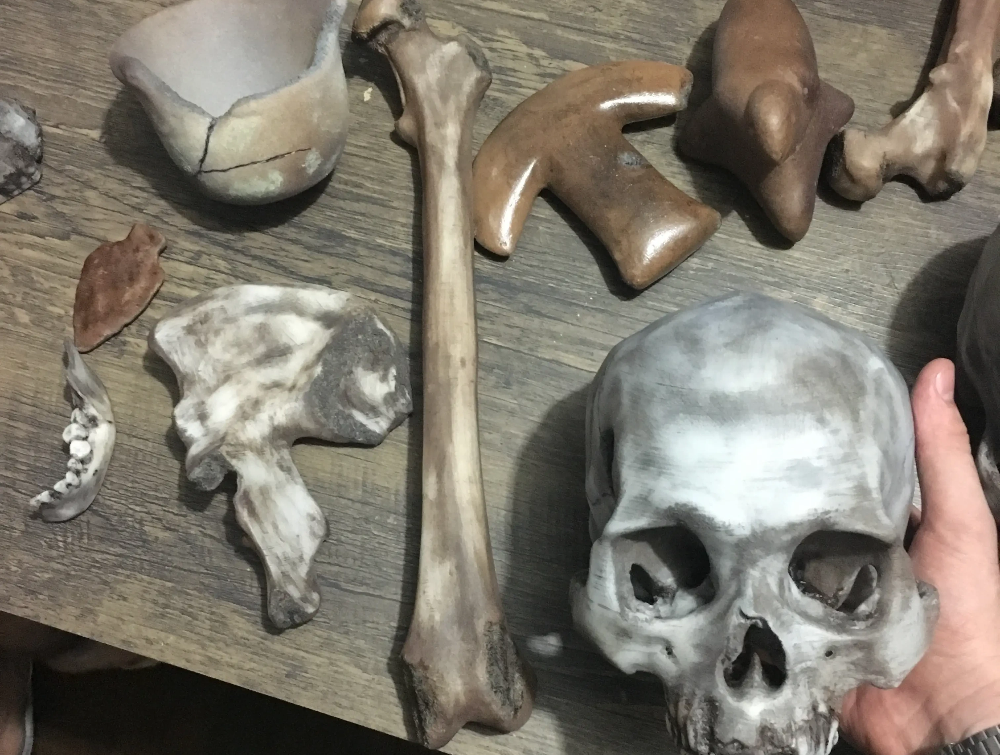
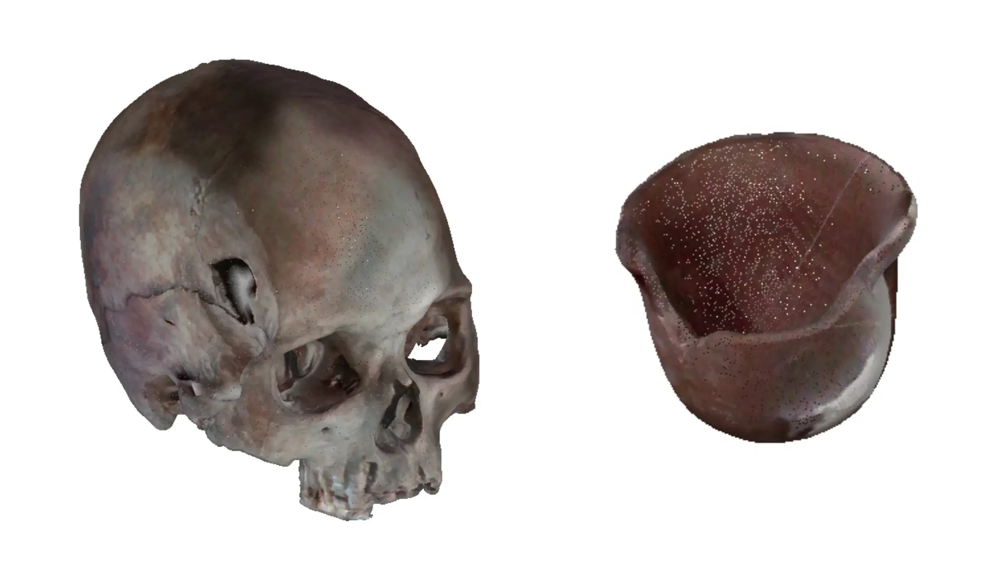
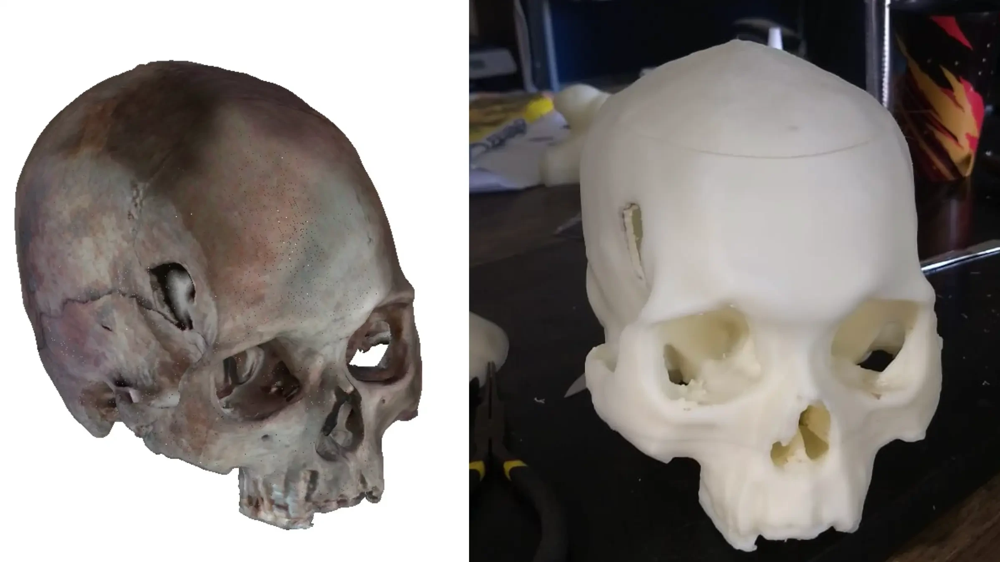
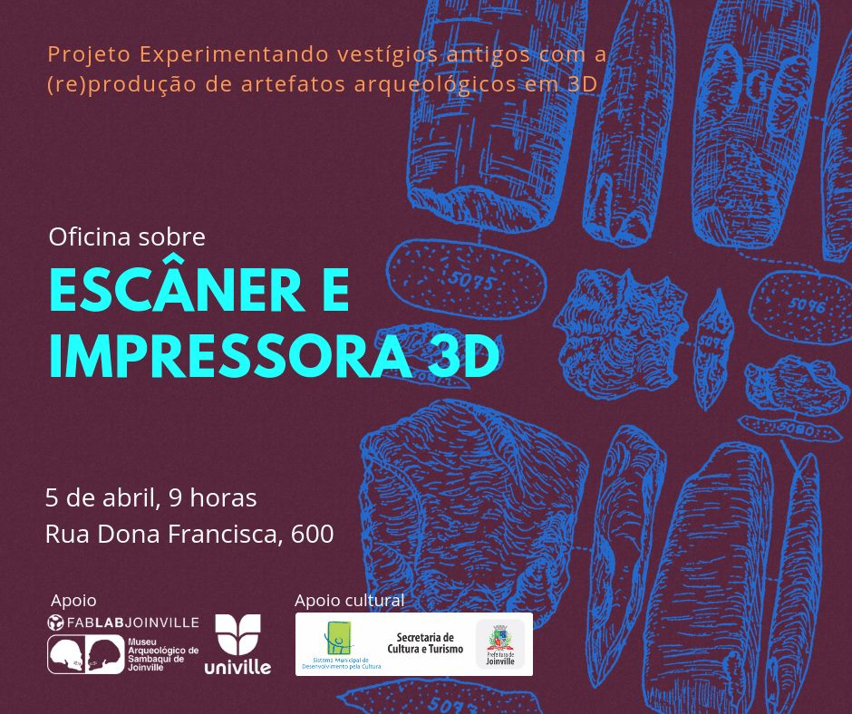
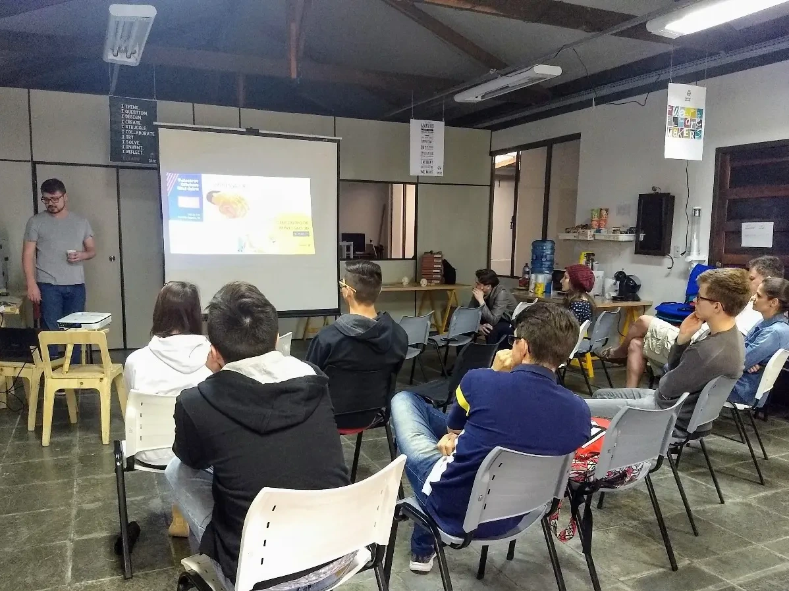

O Archeotech foi um projeto de digitalização e reprodução de artefatos arqueológicos de Joinville. Realizado em parceria com o [Museu Arqueológico de Sambaqui de Joinville](https://www.joinville.sc.gov.br/institucional/secult/upm/mas/), o [Fab Lab Joinville](https://www.fablabjoinville.com.br/) e a [Univille](https://www.univille.edu.br/), o projeto registrou peças do acervo em 3D e produziu réplicas para atividades educativas e de divulgação. O objetivo foi ampliar o acesso ao patrimônio arqueológico sem exigir o manuseio frequente dos objetos originais. Os modelos digitais também documentam as características físicas dos artefatos e podem apoiar pesquisas, exposições e ações de conservação.

## Digitalização e reprodução

Os artefatos foram digitalizados com um escâner 3D sem contato, baseado em infravermelho. A câmera capturou dados da superfície de cada peça, que foram processados para gerar modelos digitais.

## Educação

Foram realizados diversos workshops de formação ao longo do projeto, abordando temas como impressão 3D, escaneamento e arqueologia. Os encontros abordaram os desafios da arqueologia e o uso da impressão e do escaneamento 3D na documentação, reprodução e mediação de artefatos. A impressora e o escâner 3D foram apresentados ao público, que discutiu as aplicações e as limitações dessas tecnologias.

## Parcerias

- [Fab Lab Joinville](https://web.archive.org/web/20211019142452/http://www.fablabjoinville.com.br/): espaço de educação, inovação e fabricação digital.
- [Museu Arqueológico de Sambaqui de Joinville (MASJ)](https://web.archive.org/web/20211019142452/https://www.joinville.sc.gov.br/institucional/masj/): instituição dedicada à preservação do patrimônio arqueológico e à pesquisa sobre os povos que habitaram a região.
- [Laboratório de Arqueologia da Universidade da Região de Joinville (Univille)](https://web.archive.org/web/20211019142452/http://www.univille.edu.br//pt-br/institucional/proreitorias/prppg/setores/pos-graduacao/mestradosdoutorado/patrimonioculturalsociedade/infra/601202): laboratório voltado a estudos de patrimônio arqueológico, atividades de campo e análise de artefatos.
