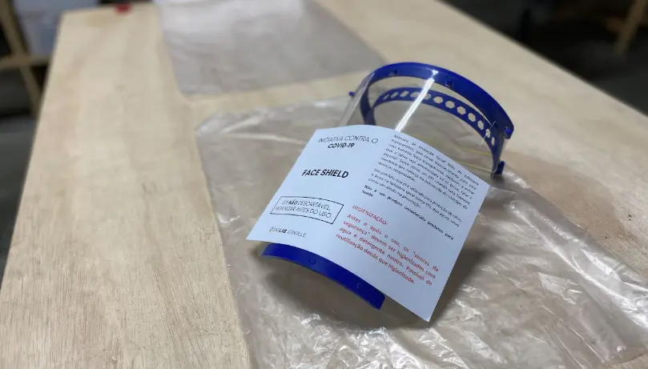
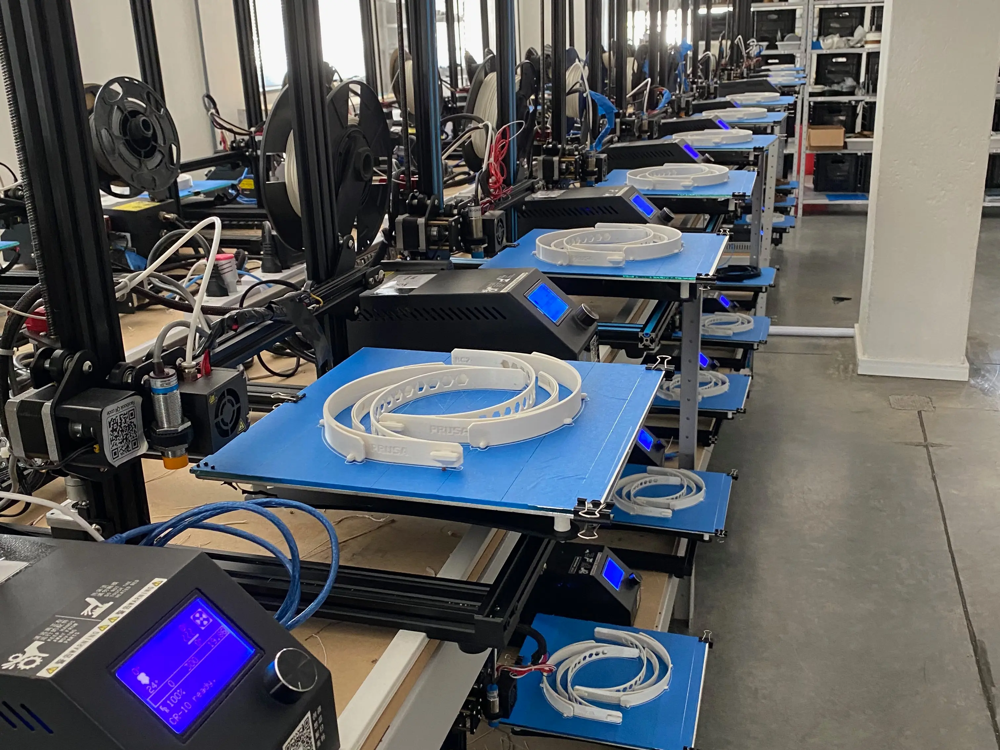
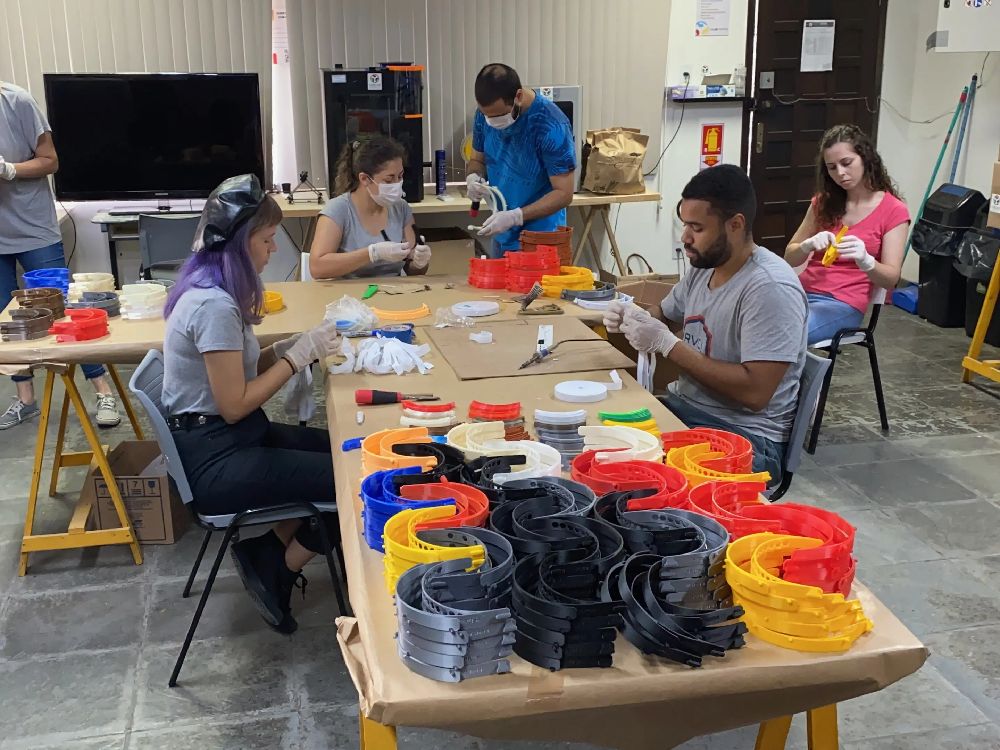
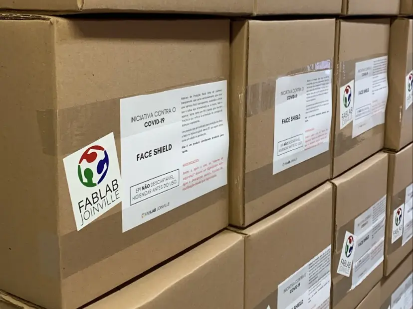
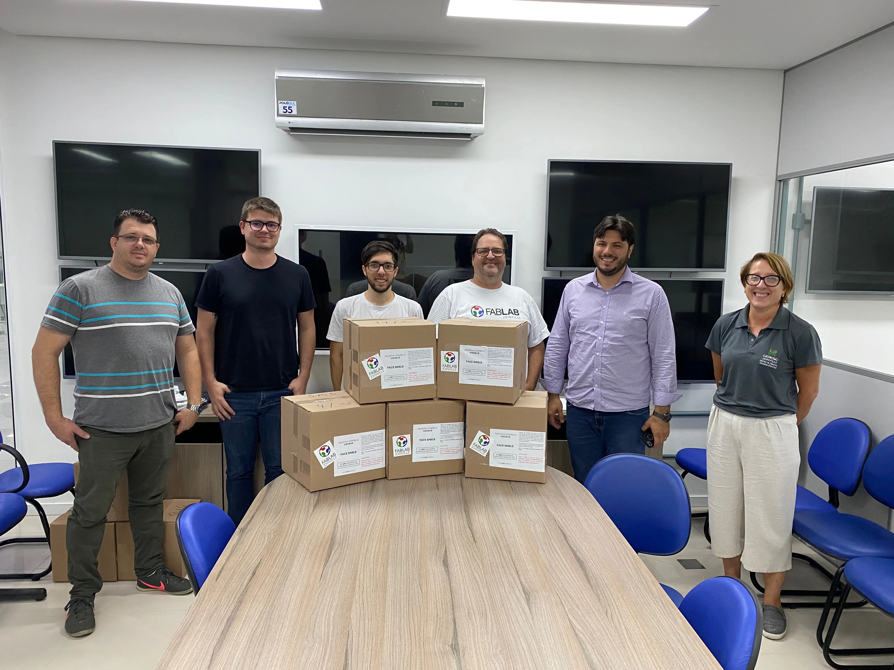
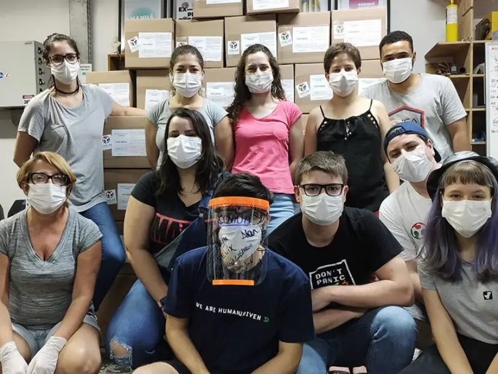

Durante a pandemia de COVID-19, diante da escassez de face shields no mercado, o Fab Lab Joinville mobilizou a comunidade para produzi-las para profissionais de saúde. Esses equipamentos funcionam como uma barreira adicional de proteção e ajudaram a atender uma demanda urgente dos hospitais.

Cada face shield era composta por três partes: uma estrutura produzida em impressoras 3D, que sustenta a viseira; uma viseira de acetato, doada pela Plastibras, que cria a barreira transparente de proteção; e um elástico, doado pelo grupo Romãs, que mantém o equipamento ajustado à cabeça.

Para viabilizar a produção em escala, o laboratório colocou diversas impressoras 3D em operação e contou com a parceria de diversas empresas da cidade.

Depois da impressão, voluntários montavam as estruturas, fixavam as viseiras e preparavam os equipamentos para entrega.

## Produção e doações

Com o apoio de voluntários e doações de materiais, o Fab Lab Joinville produziu e doou 1.400 face shields para a rede pública de saúde da cidade e instituições privadas de saúde.

Os equipamentos foram embalados e identificados antes da distribuição.

A iniciativa mostrou como a colaboração entre a comunidade, empresas e o poder público pode responder rapidamente a uma necessidade coletiva.

