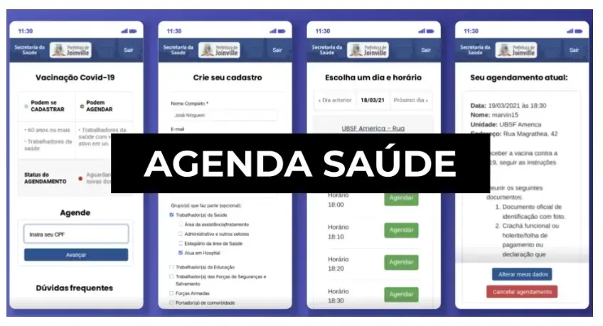
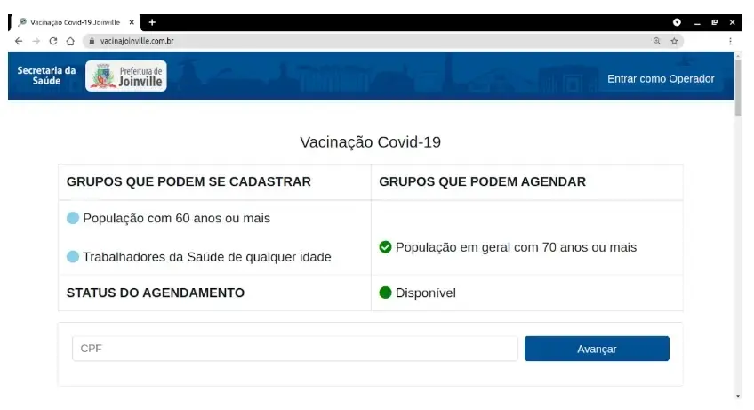
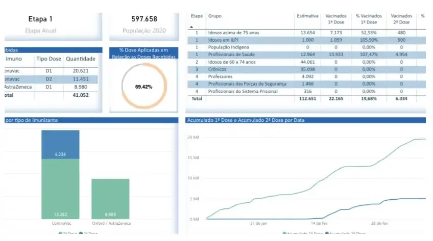

During the COVID-19 pandemic, booking a vaccine or test could mean dealing with queues, scattered information, and uncertainty. In Joinville, the Fab Lab Joinville community and Magrathea Labs joined the Municipal Health Department to help organize access to these services.

Agenda Saúde emerged from this partnership as a platform for checking and booking COVID-19 vaccination and test appointments in the public health system. Fab Lab was contracted by the City of Joinville to operate the system at no cost to the municipality.

The goal was to let people choose a date and time before leaving home. By bringing appointments together in one place, the platform helped distribute demand and gave both residents and health services more predictability.

More than 550,000 people used the system during the pandemic.

At an already difficult time, the booking process needed to be clear. The experience was designed for people with different levels of familiarity with technology, taking them from registration to confirmation without unnecessary steps.

Agenda Saúde supported the organization of vaccines and tests during the public health emergency. The project shows how a local community, companies, and public authorities can work together to respond quickly to a collective need.

The platform remains in use for public health appointments. It is now maintained by the City of Joinville's IT team.

