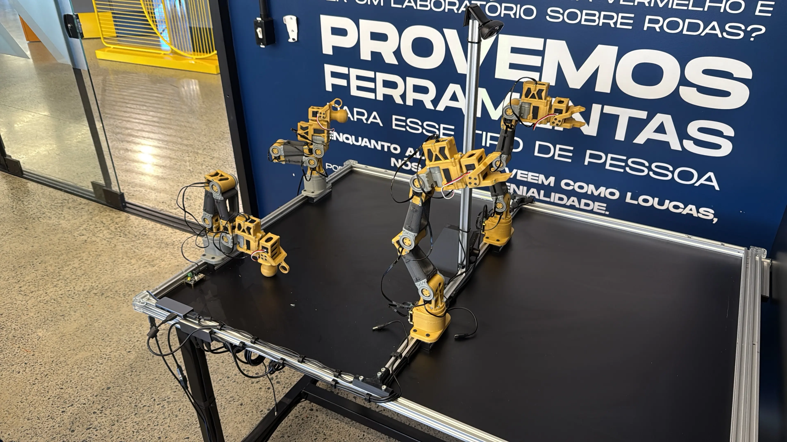
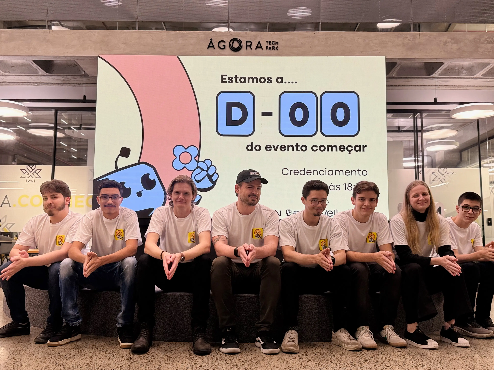

No fim de 2024, iniciei uma investigação sobre aplicações de machine learning na robótica ([Physical AI](https://www.nvidia.com/en-us/glossary/generative-physical-ai/)), com foco em modelos [vision-language-action (VLA)](https://en.wikipedia.org/wiki/Vision%E2%80%93language%E2%80%93action_model). Nesse contexto, conheci o [LeRobot](https://huggingface.co/lerobot), iniciativa open source da Hugging Face, e passei a usar o braço robótico SO-100 como plataforma de experimentação.

O LeRobot reúne modelos pré-treinados, conjuntos de dados e ferramentas para coletar demonstrações, treinar políticas de controle e operar braços robóticos. A plataforma torna mais acessível o processo de transformar demonstrações humanas em comportamentos reproduzíveis por uma máquina, embora os desafios da interação com o mundo físico permaneçam.

Os experimentos foram conduzidos em um notebook Avell equipado com uma GPU NVIDIA RTX 3070. A coleta de dados mostrou-se a etapa mais determinante do processo. Cada demonstração exigia movimentos consistentes, bom posicionamento das câmeras e execução precisa da tarefa. Variações aparentemente pequenas na trajetória, no enquadramento ou na manipulação dos objetos afetam diretamente a qualidade do conjunto de dados e, consequentemente, o comportamento aprendido pelo robô.

Uma das aplicações investigadas surgiu em conversas com profissionais da indústria têxtil: treinar o braço para dobrar roupas. Embora seja uma tarefa cotidiana para uma pessoa, ela exige que o sistema lide com um objeto flexível, sujeito a variações de posição e de forma. O experimento foi um recorte útil para entender como uma atividade manual pode ser modelada, demonstrada e refinada com base em dados.

## Hackathon mundial

O [LeRobot Arm Hackathon](https://huggingface.co/LeRobot-worldwide-hackathon) foi um evento internacional promovido pela Hugging Face. Inscrevemos o Fab Lab Joinville para sediar a edição brasileira do evento. A iniciativa reuniu a comunidade de tecnologia de Joinville para um fim de semana de exploração prática da plataforma.

O vídeo abaixo registra os desafios, as equipes e as demonstrações que marcaram o evento:

### Projetos apresentados

As equipes exploraram aplicações distintas para o braço robótico, da interação lúdica à teleoperação e à manipulação de objetos. Abaixo estão alguns dos projetos apresentados que eu mais gostei, e seus vídeos finais.

**João Sem Braço**

Uma demonstração de interação lúdica em que o braço robótico participa de uma partida de UNO.

**Sbórshchiki frúktov**

Proposta de colheita de maçãs, investigando como o braço pode identificar, alcançar e manipular frutas.

**L.A.E.L.E**

Experimento de force feedback para incorporar retorno tátil à operação do braço.

**LAPESP**

Controle do braço robótico diretamente pelo navegador, explorando uma interface web para operação remota.

O time que organizou o evento:

