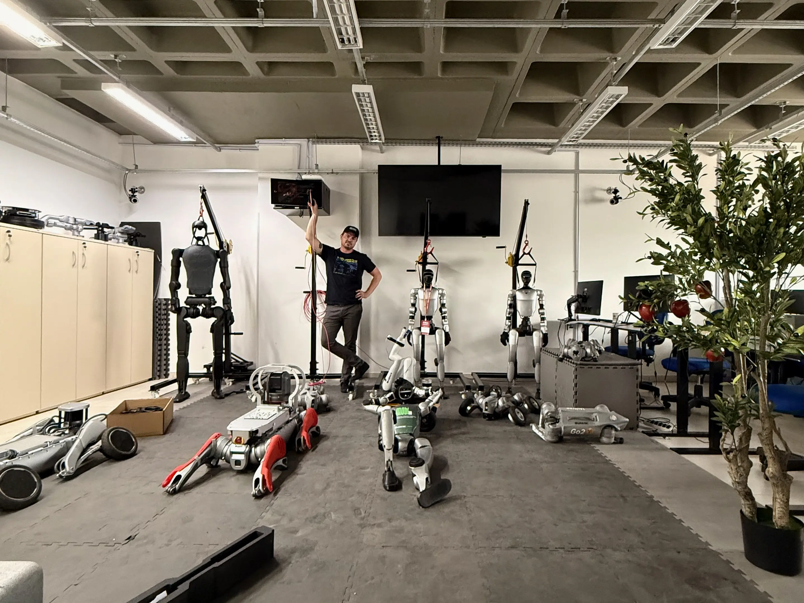
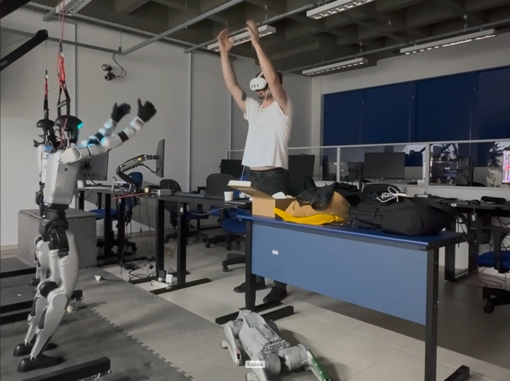
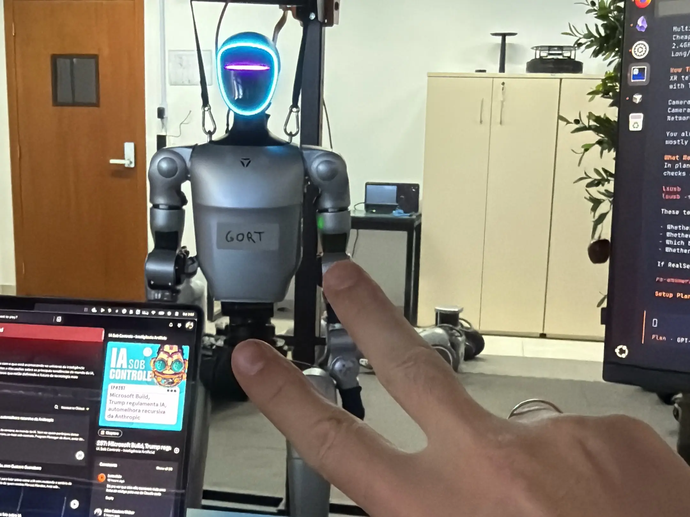

My work with [LeRobot](/en/projects/2025-physical-ai/) and educational robotic arms was the starting point for investigating Physical AI in humanoid manipulation tasks, a project I have been developing in collaboration with UDESC's MobiLab.

In recent months, I have been working with Unitree's G1. These robots follow a simple DDS-based protocol and have solid SDKs. But doing anything with them beyond using the remote control is challenging. Before sending commands, you need to check its state machine. You also need to pay attention to joint control, camera integration, and a stable connection between the development computer and the robot. It is not a single computer, but several computers exchanging messages. I am documenting this process on the [MobiLab wiki](https://mobilab.joinville.udesc.br/guides/unitree-g1).

I configured an initial teleoperation setup with a Meta Quest 3, RealSense cameras, and control of the G1's arms. With this setup, I can already record demonstrations of manipulation tasks. Each recording brings together the operator's movements, camera images, and commands sent to the robot. I still need to improve the quality and consistency of these demonstrations. The video below shows one of the first tests.

These demonstrations will be used to test vision-language-action models such as Isaac GR00T and ACT. First, I want to evaluate the policies in simulation. Then, I will test them on the robot with safety limits and gradual execution. The most practical problem I am exploring is finding or developing teleoperation, training, and execution methods that are economically viable in Brazil.

At MobiLab, I work in partnership with Luca Mateo Rangel, whom I met during the LeRobot hackathon. Our plan is to document the G1 setup and turn recurring tasks into reusable scripts and configurations. This should reduce the time required to prepare the robot, start teleoperation, and repeat data-collection tests in future laboratory projects.

